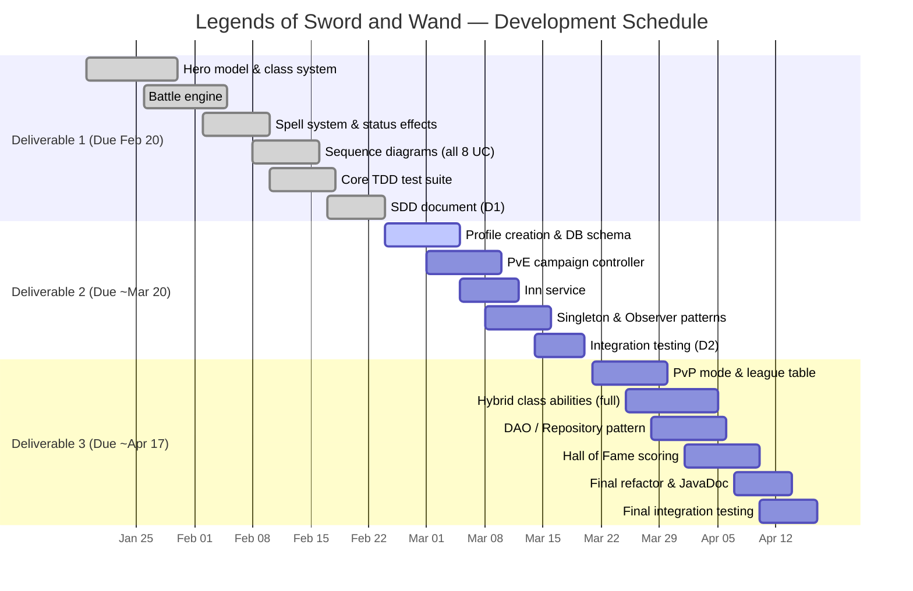

# Software Design Document
## Legends of Sword and Wand

---

### Document Change Control

| Version | Date | Author(s) | Summary of Changes |
|---------|------|-----------|-------------------|
| 0.1 | 2026-02-24 | Person A | Initial draft — Person A sections (core logic, battle engine, spells, diagrams, TDD) |
| 0.2 | 2026-02-24 | Person A | Added architecture, class diagrams, design patterns, full test case table |

---

## Table of Contents

1. [Introduction](#1-introduction)
2. [Sequence Diagrams](#2-sequence-diagrams)
3. [Major Design Decisions](#3-major-design-decisions)
4. [Architecture](#4-architecture)
5. [Class Diagrams](#5-class-diagrams)
6. [Use of Design Patterns](#6-use-of-design-patterns)
7. [Activities Plan](#7-activities-plan)
8. [Test Driven Development](#8-test-driven-development)
9. [Use of AI](#9-use-of-ai)

---

## 1. Introduction

### Purpose
Legends of Sword and Wand is a Java-based RPG system modelled after tabletop games such as Dungeons & Dragons. The purpose of this document is to describe the software design decisions, architecture, class structure, design patterns, and test strategy for the system, as produced for Deliverable 1 of the CSSD2203 / DIGT3141 Winter 2026 group project.

### Overview
The system supports four hero classes (Order, Chaos, Warrior, Mage) with a specialization and hybridization progression system. Heroes engage in turn-based battles in both a Player vs. Environment (PvE) campaign mode and a Player vs. Player (PvP) mode. The core battle engine is deterministic (apart from Chain Lightning target shuffling), and all class-specific behaviour is encapsulated behind the Strategy pattern. The system is decomposed into a Domain/Model layer, a Service layer, a Presentation layer, and a Persistence layer.

### References
- Project Description Document — *Legends of Sword and Wand*, CSSD2203/DIGT3141 Winter 2026
- Assignment Instructions — Deliverable 1, CSSD2203/DIGT3141 Winter 2026
- GitHub Repository: *(add URL here)*

---

## 2. Sequence Diagrams

Each diagram is provided as a Mermaid file in `UML-diagrams/UML-mermaid/`. Below is a summary table and short description of each use case.

| # | Use Case | File |
|---|----------|------|
| UC1 | Hero Creation / Recruit | `UC1-hero-creation.md` |
| UC2 | Hero Level Up | `UC2-level-up.md` |
| UC3 | Execute One Battle Turn | `UC3-execute-battle-turn.md` |
| UC4 | Cast a Special Ability | `UC4-cast-ability.md` |
| UC5 | Full Battle | `UC5-full-battle.md` |
| UC6 | PvE Campaign Room Encounter | `UC6-pve-campaign-room.md` |
| UC7 | Inn Visit | `UC7-inn-visit.md` |
| UC8 | PvP Battle | `UC8-pvp-battle.md` |

### UC1 — Hero Creation / Recruit
The player selects a name and class. `GameController` instantiates a `Hero` with standardised starting stats (level 1, 5 attack, 5 defense, 100 HP, 50 mana). The hero's constructor calls the internal `createStrategy(heroClass)` factory method, which returns the correct `HeroClassStrategy` implementation and stores it as the hero's active strategy.

### UC2 — Hero Level Up
When a hero gains enough experience (`Exp(L) = 500 + 75*L + 20*L²`), `levelUp()` is called, applying base stat growth and delegating class-specific bonuses to the active `HeroClassStrategy` via `applyLevelBonus()`. If a class reaches level 5, specialization is set; if a second class reaches level 5, hybridization replaces specialization.

### UC3 — Execute One Battle Turn
`BattleServiceImpl.takeTurn()` ticks status effects, sorts heroes by initiative, then for each hero calls `decideAction()` (AI: cast if able, defend if HP < 25%, otherwise attack). Heroes that choose WAIT are queued and act at the end in FIFO order. The turn exits early if the opposing team is wiped out.

### UC4 — Cast a Special Ability
The battle engine calls `canCast(ability)` to verify mana, then `castAbility(ability, targets)`. The hero deducts the mana cost and delegates to `Ability.execute(caster, targets)`. Each concrete subclass (Fireball, ChainLightning, BerserkerAttack, Protect, Heal, Replenish) applies its specific effect.

### UC5 — Full Battle
`BattleServiceImpl.startBattle()` creates team copies, then loops: tick status effects → sort by initiative → teamA acts → teamB acts → increment turn counter. A draw is declared after 1,000 rounds. The result is packaged in a `BattleResult` with winning team, losing team, and draw flag.

### UC6 — PvE Campaign Room Encounter
The campaign controller calculates encounter probability based on cumulative party level (base 60% battle / 40% inn, +3% toward battle per 10 cumulative levels, capped at 90%). On battle: enemy party is generated, `startBattle()` is called, then exp and gold are distributed on win, or penalties applied on loss. On inn: UC7 is triggered. After 30 rooms, a final score is calculated.

### UC7 — Inn Visit
On arrival, all heroes are automatically revived and fully restored (free). The player may then purchase food (+HP) or drink (+mana) items from the shop using gold. In the first 10 rooms, unemployed heroes (random class, level 1–4) are available to recruit: free at level 1, or 200g per level for higher levels.

### UC8 — PvP Battle
Both players select a saved party. `PvPController` validates both parties and calls `BattleServiceImpl.startBattle()` — the same engine as PvE, with no exp or gold awarded. Win/loss statistics are recorded in `LeagueService` and the league table is updated.

---

## 3. Major Design Decisions

### 3.1 Separation of Domain Logic from Orchestration
All business rules (damage formula, mana deduction, stat growth, shield absorption) reside in domain classes (`Hero`, `Ability` subclasses). `BattleServiceImpl` is a pure orchestrator — it only decides *who* acts *when* and delegates every *how* to the domain. This achieves **high cohesion** (each class has one clear responsibility) and **low coupling** (the service depends only on the `Hero` public interface, not on class-specific internals).

### 3.2 Strategy Pattern for Hero Classes
Rather than a large `switch` statement inside `Hero.levelUp()` and `Hero.getAbilities()`, class-specific behaviour is encapsulated in four `HeroClassStrategy` implementations. Adding a new class or modifying a class bonus requires only a new/modified strategy class — no changes to `Hero` itself. This satisfies the Open/Closed Principle.

### 3.3 Template Method Pattern for Abilities
`Ability` is an abstract class with a concrete `name` and `manaCost`, and an abstract `execute()` method. Each concrete ability defines only its own effect logic. This avoids code duplication for mana checks (handled by `Hero.castAbility()` before `execute()` is called) and name/cost storage.

### 3.4 Factory Method for Strategy Creation
`Hero.createStrategy(HeroClass)` is a private factory method that maps the `HeroClass` enum to a concrete strategy. This centralises instantiation and makes it trivial to swap or extend strategy classes.

### 3.5 HeroClass Enum as Identity, Strategy as Behaviour
The `HeroClass` enum is used as a *key* in the `classLevels` map (identity / data) and does not carry behaviour. Behaviour lives in the strategy. This avoids the anti-pattern of putting methods on enums and keeps the domain model clean.

### 3.6 Shallow Copy in Battle
`BattleServiceImpl` creates `new ArrayList<>(team)` copies at the start of battle so the caller's list references are not reordered by initiative sorting. The `Hero` objects themselves are shared (not deep-copied), so state changes (damage, mana loss) are visible to the caller after the battle — which is the intended behaviour for persistent party state.

---

## 4. Architecture

See `UML-diagrams/UML-mermaid/architecture.md` for the full block diagram.

### Module Table

| Module | Description | Exposed Interface |
|--------|-------------|-------------------|
| **M1: Domain Model** | Core game entities: `Hero`, `Ability`, `HeroClassStrategy`, `StatusEffect`, `BattleResult`, enums. Contains all business rules. | `Hero` public API, `Ability.execute()`, `HeroClassStrategy` interface |
| **M2: Battle Service** | Orchestrates turn-based battles between teams. Stateless. | `BattleService.startBattle(List<Hero>, List<Hero>) : BattleResult` |
| **M3: PvE Campaign** *(Person B)* | Campaign room loop, enemy generation, exp/gold distribution, score calculation. | `CampaignController.enterNextRoom()` |
| **M4: Inn Service** *(Person B)* | Hero revival, item shop, hero recruitment. | `InnService.visitInn(List<Hero>)` |
| **M5: PvP Controller** *(Person B)* | Party selection, PvP battle dispatch, league recording. | `PvPController.startPvP(partyA, partyB)` |
| **M6: Persistence** *(Person B)* | Database read/write for hero profiles, party state, campaign progress, league table. | `ProfileRepository`, `PartyRepository` |

### Interface Operations

| Interface | Operations |
|-----------|-----------|
| `BattleService` | `BattleResult startBattle(List<Hero> teamA, List<Hero> teamB)` — used by M3, M5 |
| `HeroClassStrategy` | `void applyLevelBonus(Hero hero)` — used by M1 `Hero.levelUp()` |
| | `List<Ability> getAbilities()` — used by M1 `Hero.getClassAbilities()` |
| `Ability` | `void execute(Hero caster, List<Hero> targets)` — used by M1 `Hero.castAbility()` |

---

## 5. Class Diagrams

See `UML-diagrams/UML-mermaid/class-diagrams.md` for the full Mermaid diagrams.

The diagrams cover:
- **Core Domain Model** — `Hero`, `HeroClass`, `HeroClassStrategy` hierarchy, `Ability` hierarchy, `StatusEffect`, `StatusType`, `BattleResult`
- **Battle Service** — `BattleService` interface, `BattleServiceImpl`, `Action` enum

### Class Summary

| Class | Role |
|-------|------|
| `Hero` | Central domain object. Holds stats, class levels, status effects, strategy. |
| `HeroClass` | Enum — identity key for the four classes and HYBRID. |
| `HeroClassStrategy` | Strategy interface — separates class behaviour from class identity. |
| `OrderStrategy` | Concrete strategy: +5 mana/+2 def per level; abilities: Protect, Heal. |
| `ChaosStrategy` | Concrete strategy: +3 atk/+5 hp per level; abilities: Fireball, ChainLightning. |
| `WarriorStrategy` | Concrete strategy: +2 atk/+3 def per level; ability: BerserkerAttack. |
| `MageStrategy` | Concrete strategy: +5 mana/+1 atk per level; ability: Replenish. |
| `Ability` | Abstract base for all abilities. Holds name and mana cost. |
| `Fireball` | Damages up to 3 enemies. Sorcerer variant doubles damage. |
| `ChainLightning` | Damages all enemies with decay (25% carry-over; 50% for Invoker). |
| `BerserkerAttack` | Primary + 2 splash at 25%. Knight variant stuns; Paladin heals caster first. |
| `Protect` | Shields all allies for 10% of each hero's max HP. |
| `Heal` | Heals the ally with the lowest current HP for 25% of their max HP. |
| `Replenish` | Restores 30 mana to all allies, 60 to caster. |
| `StatusEffect` | Encapsulates a timed status (STUN, SHIELD) with apply/tick/expire logic. |
| `StatusType` | Enum — STUN, SHIELD. |
| `BattleResult` | Value object — winning team, losing team, isDraw flag. |
| `BattleService` | Interface defining the battle contract. |
| `BattleServiceImpl` | Orchestrates the full battle loop; all business rules stay in domain classes. |

---

## 6. Use of Design Patterns

Six design patterns are planned for the full implementation. Two are fully implemented for Deliverable 1; the remaining four are planned for Deliverables 2 and 3.

### DP1 — Strategy Pattern ✅ (Implemented)

**Why:** Hero class behaviour (stat bonuses per level, available abilities) varies by class. Encoding this in `Hero` with conditionals would violate the Open/Closed Principle and make the class difficult to extend.

**Where:** `HeroClassStrategy` interface implemented by `OrderStrategy`, `ChaosStrategy`, `WarriorStrategy`, `MageStrategy`. `Hero` holds a `classStrategy` field and delegates `applyLevelBonus()` and `getAbilities()` to it.

**UML:** See `class-diagrams.md` → *Design Pattern: Strategy* section.

```
HeroClassStrategy «interface»
    + applyLevelBonus(Hero) : void
    + getAbilities() : List<Ability>
    + getClassName() : String
         △
         |
  ┌──────┼──────────┬──────────┐
  │      │          │          │
OrderStrategy  ChaosStrategy  WarriorStrategy  MageStrategy
```

---

### DP2 — Template Method Pattern ✅ (Implemented)

**Why:** All abilities share a common structure (name, mana cost, execution slot) but differ only in their effect logic. An abstract class enforces this structure while leaving the effect implementation to subclasses.

**Where:** `Ability` abstract class defines `name`, `manaCost`, and abstract `execute()`. Six concrete subclasses each implement only `execute()`.

**UML:** See `class-diagrams.md` → *Design Pattern: Template Method* section.

```
Ability «abstract»
    # name : String
    # manaCost : int
    + execute(Hero, List<Hero>) : void  ← abstract
         △
         |
  ┌──────┼───────┬──────────┬──────┬──────┐
  │      │       │          │      │      │
Fireball CL  Berserker  Protect  Heal  Replenish
```

---

### DP3 — Factory Method ✅ (Implemented)

**Why:** `Hero` needs to instantiate the correct strategy without depending on concrete types throughout its code. Centralising instantiation in one method makes it easy to add or modify strategy classes.

**Where:** `Hero.createStrategy(HeroClass)` — a private method that switches on the enum and returns the correct `HeroClassStrategy` concrete type.

---

### DP4 — Singleton *(Planned — Deliverable 2)*

**Where planned:** `LeagueService` and `CampaignController` — there should be exactly one instance of each managing global game state (league standings, current campaign progress). Will be implemented as a thread-safe Singleton.

---

### DP5 — Observer *(Planned — Deliverable 2)*

**Where planned:** When a hero's HP drops to zero or when a level-up occurs, interested components (UI logger, campaign controller, database persistence layer) need to react. An `Observer` / event listener pattern on `Hero` will decouple these side effects from the core domain logic.

---

### DP6 — Repository / Data Access Object (DAO) *(Planned — Deliverable 3)*

**Where planned:** Persistence layer (Person B) — `ProfileRepository` and `PartyRepository` will abstract all database operations, decoupling the service/domain layer from any specific database technology (SQLite, etc.).

---

## 7. Activities Plan

### Product Backlog

| ID | Item | Deliverable |
|----|------|-------------|
| PB-01 | Hero model + class system | D1 ✅ |
| PB-02 | Battle engine (turn-based) | D1 ✅ |
| PB-03 | Spell / ability system | D1 ✅ |
| PB-04 | Status effects (stun, shield) | D1 ✅ |
| PB-05 | Sequence diagrams (all 8 UC) | D1 ✅ |
| PB-06 | Core test suite (27 tests) | D1 ✅ |
| PB-07 | Profile creation & persistence | D2 |
| PB-08 | PvE campaign controller | D2 |
| PB-09 | Inn service | D2 |
| PB-10 | Database integration (SQLite) | D2 |
| PB-11 | Singleton pattern (LeagueService, CampaignController) | D2 |
| PB-12 | Observer pattern (HP/level-up events) | D2 |
| PB-13 | PvP mode + league table | D3 |
| PB-14 | Hybrid class ability upgrades (full set) | D3 |
| PB-15 | Repository / DAO pattern | D3 |
| PB-16 | Hall of Fame scoring | D3 |
| PB-17 | Full integration testing | D3 |
| PB-18 | Final refactoring & JavaDoc | D3 |

### GANTT Diagram



---

## 8. Test Driven Development

All 27 tests pass as of Deliverable 1 (`mvn test`: 27 run, 0 failures, 0 errors).

Test files:
- `src/test/java/model/HeroTest.java` — 22 tests
- `src/test/java/service/BattleServiceTest.java` — 5 tests

### Test Case Table

| Test ID | Category | Requirements Coverage | Initial Condition | Procedure | Expected Outcome | Notes |
|---------|----------|-----------------------|-------------------|-----------|-----------------|-------|
| TC-01 | Hero Model — Initial State | UC1: Hero Creation | System running, no hero exists | 1. Create `new Hero("Alice", HeroClass.WARRIOR)` | Hero has level=1, HP=100, mana=50, isAlive=true, isStunned=false | Verifies spec starting stats |
| TC-02 | Hero Model — Level Up | UC2: Hero Level Up (base growth) | Hero at level 1 (WARRIOR) | 1. Call `hero.levelUp(HeroClass.WARRIOR)` | HP increases by +5 (base), mana by +2 (base), level becomes 2 | Base growth only; class bonus tested separately |
| TC-03 | Hero Model — Class Bonus | UC2: Hero Level Up (ORDER bonus) | Hero at level 1 (ORDER) | 1. Call `hero.levelUp(HeroClass.ORDER)` | Mana increases by +7 (+2 base +5 Order), defense increases by +3 (+1 base +2 Order) | Verifies Strategy pattern delegation |
| TC-04 | Hero Model — Class Bonus | UC2: Hero Level Up (CHAOS bonus) | Hero at level 1 (CHAOS) | 1. Call `hero.levelUp(HeroClass.CHAOS)` | Attack increases by +4 (+1 base +3 Chaos), HP increases by +10 (+5 base +5 Chaos) | Verifies ChaosStrategy.applyLevelBonus() |
| TC-05 | Hero Model — Specialization | UC2: Hero Level Up (specialization) | Hero at level 1 (WARRIOR) | 1. Call `hero.levelUp(HeroClass.WARRIOR)` 4 more times | `getSpecializationClass()` returns `WARRIOR`; `getHybridClass()` returns null | Class level reaches 5; first specialization triggers |
| TC-06 | Hero Model — Specialization guard | UC2: Hero Level Up | Hero at level 1 (ORDER) | 1. Level up ORDER class 3 more times (total level 4 in ORDER) | `getSpecializationClass()` returns null | Specialization only triggers at class level 5, not before |
| TC-07 | Hero Model — Hybridization | UC2: Hero Level Up (hybridization) | Hero with WARRIOR spec (class level 5) | 1. Call `hero.levelUp(HeroClass.MAGE)` 5 times | `getHybridClass()` returns `MAGE` | Two classes at level 5 triggers hybrid |
| TC-08 | Hero Model — Hybrid guard | UC2: Hero Level Up | Hero with CHAOS spec | 1. Continue levelling CHAOS beyond level 5 | `getHybridClass()` remains null | Same class cannot trigger hybridization with itself |
| TC-09 | Battle Engine — Damage Formula | UC3: Execute One Battle Turn (ATTACK) | Attacker (CHAOS L2), Defender (ORDER L1) | 1. Call `attacker.attack(defender)` | `defender.getCurrentHealth()` decreases by `max(0, atk - def)` | Core damage formula: `max(0, UA(atk) - UD(def))` |
| TC-10 | Battle Engine — Zero Damage | UC3: Execute One Battle Turn (ATTACK) | Weak attacker vs high-defense tank | 1. Give tank 5 WARRIOR level-ups; 2. Call `weakAttacker.attack(tank)` | Tank HP unchanged or reduced by at most 1 | Damage cannot go negative |
| TC-11 | Battle Engine — Defend Action | UC3: Execute One Battle Turn (DEFEND) | Hero with reduced HP and mana | 1. Drain hero HP and mana; 2. Call `hero.defend()` | HP restores +10, mana restores +5 | Defend forfeits turn but restores resources |
| TC-12 | Battle Engine — Defend Clamp | UC3: Execute One Battle Turn (DEFEND) | Hero at full HP and full mana | 1. Call `hero.defend()` | HP and mana stay at their respective maximums | Defend cannot exceed maxHealth or maxMana |
| TC-13 | Battle Engine — Shield Absorption | UC3: Execute One Battle Turn (shield) | Hero with 20 shield HP | 1. Call `hero.takeDamage(15)` | `getCurrentHealth()` = 100; `getShieldAmount()` = 5 | Shield absorbs damage before real HP is reduced |
| TC-14 | Battle Engine — Shield Overflow | UC3: Execute One Battle Turn (shield overflow) | Hero with 10 shield HP | 1. Call `hero.takeDamage(30)` | `getCurrentHealth()` = 80; `getShieldAmount()` = 0 | Shield fully consumed; remaining damage hits HP |
| TC-15 | Battle Engine — Hero Death | UC3: Execute One Battle Turn (death) | Hero at 100 HP | 1. Call `hero.takeDamage(100)` | `getCurrentHealth()` = 0; `isAlive()` = false | Hero is marked dead when HP ≤ 0 |
| TC-16 | Spell System — Protect | UC4: Cast a Special Ability (Protect) | 3-hero team; caster has ≥25 mana | 1. Call `caster.castAbility(new Protect(), team)` | All team members have shieldAmount = 10% of maxHP; caster mana reduced by 25 | Protect costs 25 mana, shields entire team |
| TC-17 | Spell System — Heal | UC4: Cast a Special Ability (Heal) | Team with one injured hero; caster has ≥35 mana | 1. Injure one hero; 2. Call `caster.castAbility(new Heal(), team)` | Lowest-HP hero healed by 25% of their maxHP; healthy hero untouched | Heal targets the ally with lowest current HP |
| TC-18 | Spell System — Fireball | UC4: Cast a Special Ability (Fireball) | 4-enemy team; caster has ≥30 mana and higher ATK than targets' DEF | 1. Call `caster.castAbility(new Fireball(), enemies)` | First 3 enemies take damage; 4th enemy HP unchanged | Fireball hits at most 3 targets |
| TC-19 | Spell System — BerserkerAttack | UC4: Cast a Special Ability (Berserker) | 3-enemy team; attacker levelled up | 1. Call `new BerserkerAttack().execute(attacker, enemies)` | Primary target takes full damage; 2 splash targets take 25% of primary damage | Berserker hits primary + 2 splash at 25% |
| TC-20 | Spell System — Replenish | UC4: Cast a Special Ability (Replenish) | Caster and ally with partially drained mana | 1. Drain caster and ally mana; 2. Call `new Replenish().execute(caster, [caster, ally])` | Caster mana restored by +60 (capped); ally mana restored by +30 (capped) | Replenish gives caster double the mana of allies |
| TC-21 | Battle Engine — Stun | UC3: Execute One Battle Turn (status effect) | Hero with no status effects | 1. Apply `new StatusEffect(StatusType.STUN, 1)` to hero; 2. Call `hero.processStatusEffects()` | After apply: `isStunned()` = true; after tick: `isStunned()` = false | Stun lasts exactly 1 turn |
| TC-22 | Hero Model — Revive | UC7: Inn Visit (revive) | Hero with 0 HP (dead) | 1. Kill hero with `takeDamage(100)`; 2. Call `hero.revive()` | `isAlive()` = true; `getCurrentHealth()` = `getCurrentMaxHealth()` | Revive fully restores HP, mana, and alive status |
| TC-23 | Full Battle — Stronger team wins | UC5: Full Battle | One heavily levelled Chaos hero vs one level-1 Order hero | 1. Level up Chaos hero 10 times; 2. Call `startBattle(...)` | `BattleResult.getWinningTeam()` contains the Chaos hero; `isDraw()` = false | Basic battle outcome validation |
| TC-24 | Full Battle — Team wipeout | UC5: Full Battle | Uneven teams | 1. Level up one hero significantly; 2. Call `startBattle(...)` | Losing team has no alive heroes | Battle must end when a full team is eliminated |
| TC-25 | Full Battle — Draw | UC5: Full Battle | Two heavily defensive ORDER heroes | 1. Level up both ORDER heroes 15 times; 2. Call `startBattle(...)` | `BattleResult.isDraw()` = true | Draw declared after 1,000 turns without a winner |
| TC-26 | Full Battle — Multi-hero team | UC5: Full Battle | 2-hero teamA vs 1-hero teamB | 1. Create mixed teams; 2. Call `startBattle(...)` | Team with two heroes wins; result is non-null and non-draw | Battle engine handles teams of different sizes |
| TC-27 | Full Battle — Originals unmodified | UC5: Full Battle | Original team lists passed to `startBattle()` | 1. Record original list order; 2. Run battle; 3. Check original list | Original team list order is unchanged after battle | Battle engine works on shallow copies |

---

## 9. Use of AI

GitHub Copilot (GPT-4o) was used to assist with this project. The following sections and artifacts were produced with AI assistance:

| Section / Artifact | Type | AI Usage |
|-------------------|------|----------|
| Section 2 — All 8 sequence diagrams | Mermaid diagrams | AI-generated, reviewed and corrected by author |
| Section 5 — Class diagrams | Mermaid diagrams | AI-generated, reviewed and corrected by author |
| Section 4 — Architecture diagram | Mermaid diagram | AI-generated, reviewed and corrected by author |
| Section 7 — GANTT diagram | Mermaid diagram | AI-generated, reviewed and corrected by author |
| `Hero.java` | Source code | AI-assisted implementation, reviewed and tested by author |
| `BattleServiceImpl.java` | Source code | AI-assisted implementation, reviewed and tested by author |
| `model/ability/*.java` | Source code | AI-assisted implementation, reviewed and tested by author |
| `model/heroclass/*.java` | Source code | AI-assisted implementation, reviewed and tested by author |
| `HeroTest.java`, `BattleServiceTest.java` | Source code | AI-assisted, all 27 tests verified passing by author |
| SDD document text | Text | AI-assisted drafting, reviewed and edited by author |

**AI Model:** GitHub Copilot powered by GPT-4o, accessed via Visual Studio Code, February 2026.
