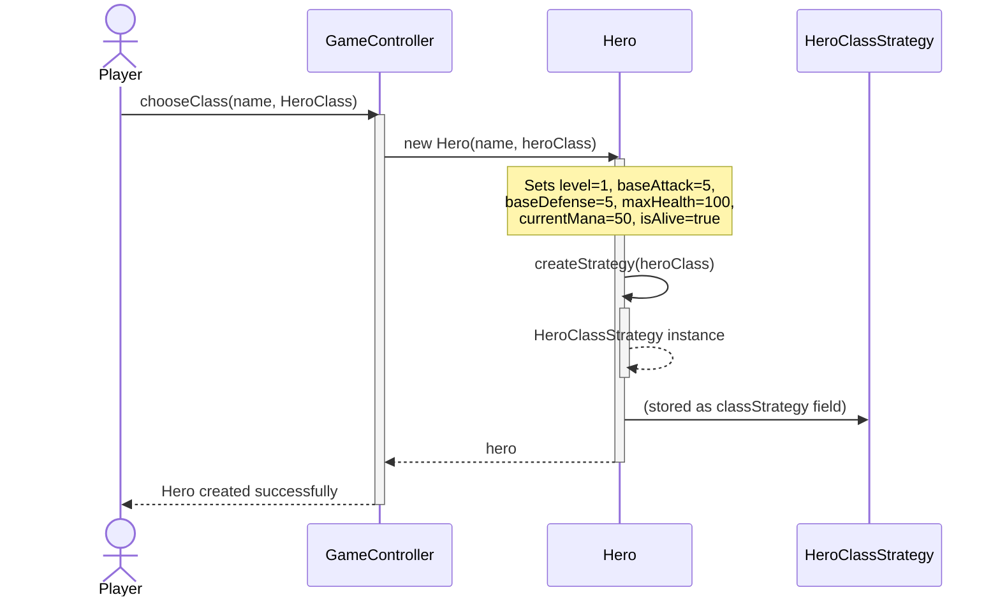

# UC1 — Hero Creation / Recruit

## Description
This use case captures the creation of a new hero when a player selects a class at the start of the game or when recruiting a hero at an inn. The player provides a name and chooses one of the four available classes (ORDER, CHAOS, WARRIOR, MAGE). The system instantiates a `Hero` object with the standardised starting stats defined in the specification (level 1, 5 attack, 5 defense, 100 HP, 50 mana), assigns the chosen class to the `classLevels` map, and selects the appropriate `HeroClassStrategy` implementation via the factory method. The created `Hero` is then returned to the caller (game controller or party manager) ready for use in battle or levelling.

