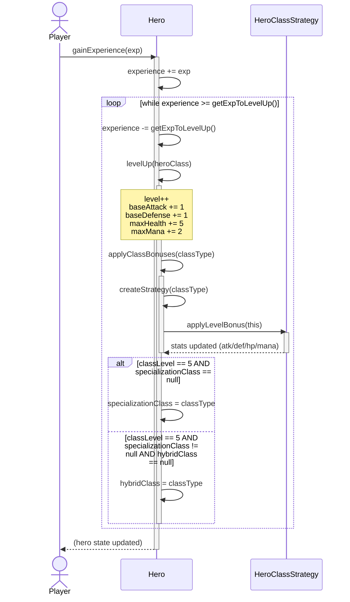

# UC2 — Hero Level Up

## Description
This use case describes the sequence of events when a hero accumulates enough experience to level up. The player (or system, post-battle) calls `gainExperience(exp)` on the hero. The hero adds the experience to its total and checks it against the threshold formula `Exp(L) = 500 + 75*L + 20*L²`. If the threshold is met, `levelUp(classType)` is called, applying base stat growth (+1 atk, +1 def, +5 HP, +2 mana), then delegating class-specific bonuses to the active `HeroClassStrategy` via `applyLevelBonus()`. After applying bonuses, the hero checks whether any class has reached level 5 to trigger specialization, and if a second class also reaches level 5, hybridization is set. The loop continues until experience no longer meets the threshold, allowing multiple level-ups from a single experience gain.

