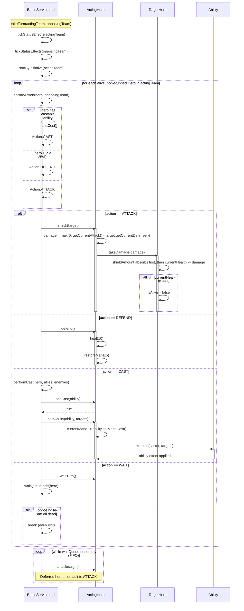

# UC3 — Execute One Battle Turn

## Description
This use case describes the sequence of events when `BattleServiceImpl` executes a single turn for the acting team against the opposing team. At the start of each round, status effects are ticked for all heroes on both teams. Each team is then sorted by initiative (highest level first, ties broken by highest attack). For every alive, non-stunned hero, the AI (`decideAction`) chooses one of four actions: ATTACK, DEFEND, CAST, or WAIT. ATTACK deals damage using the formula `max(0, attacker.getCurrentAttack() − defender.getCurrentDefense())`; DEFEND restores +10 HP and +5 mana; CAST spends mana and invokes an Ability; WAIT defers the hero to a FIFO queue that acts after all normal heroes. Stunned heroes are skipped for that turn (their stun flag is consumed by the status-effect tick). The turn ends early if the opposing team is wiped out mid-turn.

