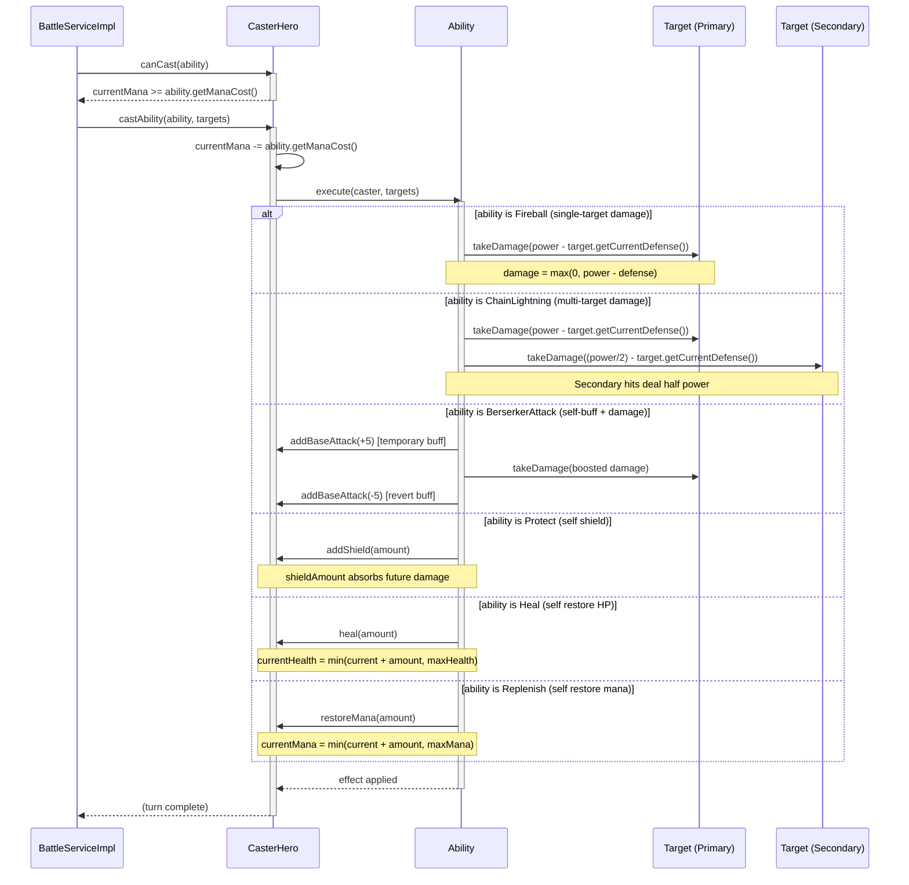

# UC4 — Cast a Special Ability

## Description
This use case describes the sequence when a hero casts a special ability during their turn. The battle engine calls `canCast(ability)` to verify the hero has sufficient mana, then calls `castAbility(ability, targets)`. The hero deducts the mana cost and delegates execution to the `Ability` object by calling `execute(caster, targets)`. The concrete ability subclass (Fireball, ChainLightning, Protect, Heal, BerserkerAttack, or Replenish) then applies its effect—dealing damage, applying status effects, granting shields, or restoring resources—to one or more targets. The diagram covers the three primary ability archetypes: single-target damage (Fireball), multi-target damage (ChainLightning), and self/ally support (Heal / Protect / Replenish).

