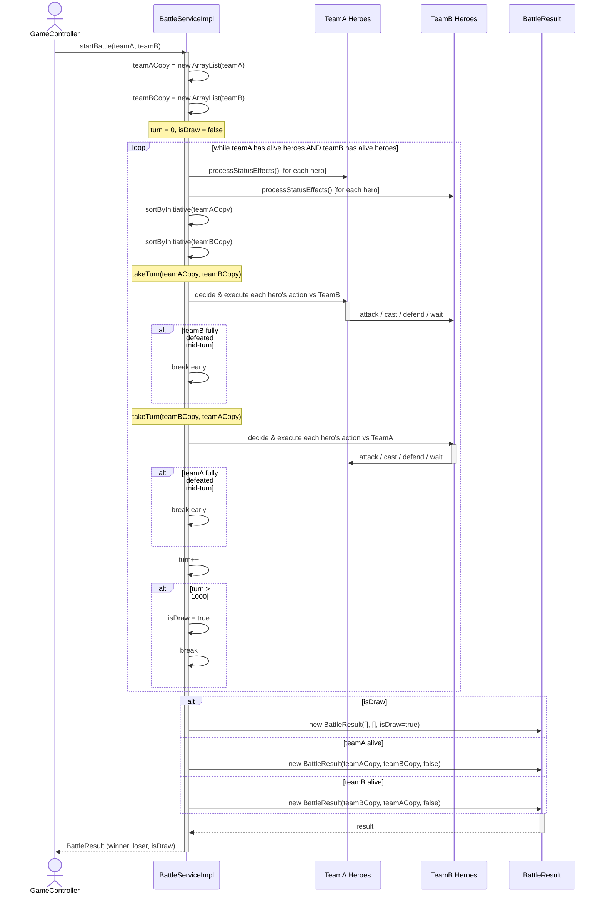

# UC5 — Full Battle

## Description
This use case describes the complete lifecycle of a team vs. team battle from start to finish. The caller (game controller) invokes `startBattle(teamA, teamB)` on `BattleServiceImpl`. The service creates working copies of both teams so the originals remain unmodified, then enters the main battle loop. Each iteration: (1) status effects are ticked for every hero on both teams, (2) each team is sorted by initiative, (3) teamA heroes take their turns against teamB, then (4) teamB heroes take their turns against teamA. After both sets of turns the round counter increments; a draw is declared if 1,000 rounds elapse without a winner. The loop exits when one team has no alive heroes. The service then constructs a `BattleResult` recording the winning team, losing team, and draw flag, and returns it to the caller.

