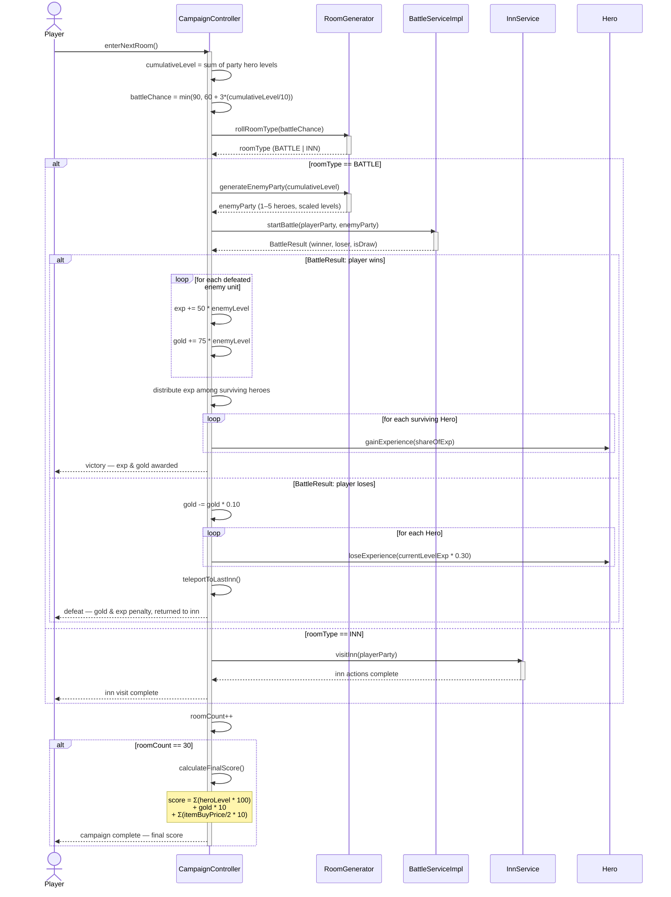

# UC6 — PvE Campaign Room Encounter

## Description
This use case describes what happens when the player enters a room during the PvE campaign. The campaign controller evaluates the cumulative level of the player's party to determine the encounter probabilities (base: 60% battle / 40% inn, shifting +3% toward battle for every 10 cumulative hero levels, capped at 90%/10%). A random roll decides the room type. If the room is a **battle**, a scaled enemy party (1–5 units, levels 1–10 scaled to the player's cumulative level) is generated and `startBattle()` is called. On victory the player earns experience (`Exp(L) = 50*L` per enemy unit, split among surviving heroes) and gold (`G(L) = 75*L` per enemy); on defeat, the player loses 10% gold and 30% of current-level experience and is returned to the last inn. If the room is an **inn**, the inn visit use case (UC7) is triggered. After 30 rooms the campaign ends and a final score is computed (100 pts per hero level + 10 pts per gold coin + 0.5× item purchase price × 10 for each item bought).

