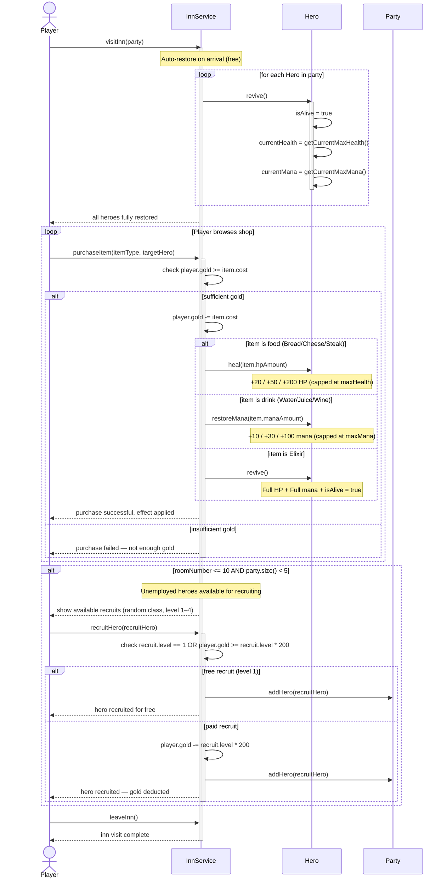

# UC7 — Inn Visit

## Description
This use case describes what happens when the player's party visits an inn, either because the campaign room rolled an inn encounter or because the player was sent back after a defeat. On arrival, `InnService` automatically revives all fallen heroes and fully restores every hero's HP and mana at no cost. The player may then browse the shop and purchase food items (+HP) or drink items (+mana), provided they have enough gold; each purchase immediately applies the item's effect to the chosen hero and deducts the gold cost. In the first 10 rooms, one or more unemployed heroes may also be present for recruiting: level 1 heroes join for free, while higher-level heroes cost 200g per level. Recruiting adds the hero to the party (capped at 5 members). The player leaves the inn when they choose to, and the campaign continues from where they left off.

