# UC8 — PvP Battle

## Description

```mermaid
sequenceDiagram
    actor PlayerA
    actor PlayerB
    participant PvPController
    participant BattleServiceImpl
    participant LeagueService
    participant BattleResult

    PlayerA->>PvPController: selectParty(savedPartyA)
    PlayerB->>PvPController: selectParty(savedPartyB)

    PvPController->>PvPController: validateParties(partyA, partyB)
    activate PvPController
    Note over PvPController: Both parties must have ≥1 hero

    PvPController->>BattleServiceImpl: startBattle(partyA, partyB)
    activate BattleServiceImpl

    Note over BattleServiceImpl: Runs identical turn loop as PvE<br/>(UC3 / UC5) — no special PvP logic

    BattleServiceImpl-->>PvPController: BattleResult (winner, loser, isDraw)
    deactivate BattleServiceImpl

    activate BattleResult
    deactivate BattleResult

    alt BattleResult: PlayerA wins
        PvPController->>LeagueService: recordWin(PlayerA)
        PvPController->>LeagueService: recordLoss(PlayerB)
        Note over PvPController: No exp or gold awarded (PvP rule)
        PvPController-->>PlayerA: victory
        PvPController-->>PlayerB: defeat
    else BattleResult: PlayerB wins
        PvPController->>LeagueService: recordWin(PlayerB)
        PvPController->>LeagueService: recordLoss(PlayerA)
        PvPController-->>PlayerB: victory
        PvPController-->>PlayerA: defeat
    else BattleResult: draw (isDraw == true)
        Note over PvPController: No win or loss recorded for either player
        PvPController-->>PlayerA: draw
        PvPController-->>PlayerB: draw
    end

    PvPController->>LeagueService: updateLeagueTable()
    activate LeagueService
    LeagueService-->>PvPController: league standings updated
    deactivate LeagueService

    deactivate PvPController
```

This use case describes a Player vs. Player battle. Each player selects one of their saved parties (built during a PvE campaign; up to 5 parties may be saved per player). The matchmaking controller validates that both parties are ready, then delegates to the same `BattleServiceImpl.startBattle()` used for PvE — no experience or gold is awarded for PvP outcomes. The winner is the player with at least one hero still standing when the battle ends. Win/loss statistics for both players are recorded in the league table (the `LeagueService`). A draw (turn limit exceeded) records no win or loss for either player. Because parties are assembled through different PvE runs, the two teams may have different cumulative levels or different numbers of heroes; the battle engine handles this transparently since it operates on any `List<Hero>`.

