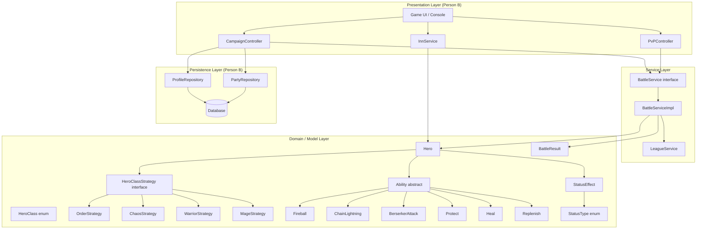

# System Architecture — Legends of Sword and Wand

## Block Diagram

## Module Descriptions

| Module | Description |
|--------|-------------|
| **Domain / Model** | Core game entities: `Hero`, `HeroClass`, `Ability` hierarchy, `StatusEffect`, `BattleResult`. Contains all business rules. |
| **Service** | Orchestrates battles via `BattleService` / `BattleServiceImpl`. Stateless; delegates all business rules to domain objects. |
| **Presentation** | Controllers for PvE campaign, PvP, and inn. Drives game flow (Person B). |
| **Persistence** | Database repositories for hero profiles and party state (Person B). |
