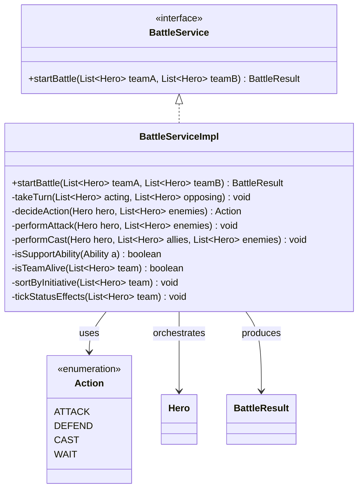
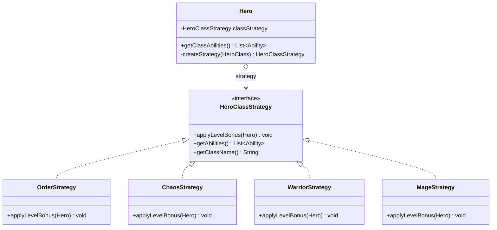
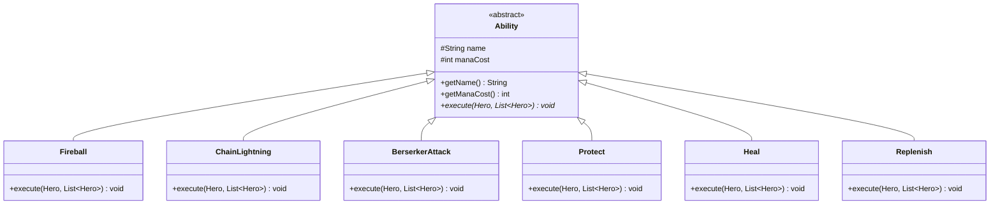

# Class Diagrams — Legends of Sword and Wand

## Core Domain Model

```mermaid
classDiagram
    class Hero {
        -String name
        -HeroClass heroClass
        -int level
        -int experience
        -int baseAttack
        -int baseDefense
        -int maxHealth
        -int currentHealth
        -int maxMana
        -int currentMana
        -int shieldAmount
        -boolean isAlive
        -boolean isStunned
        -Map~HeroClass,Integer~ classLevels
        -HeroClass specializationClass
        -HeroClass hybridClass
        -HeroClassStrategy classStrategy
        -List~StatusEffect~ statusEffects
        +Hero(String name, HeroClass heroClass)
        +attack(Hero target) int
        +defend() void
        +waitTurn() void
        +takeDamage(int damage) void
        +heal(int amount) void
        +restoreMana(int amount) void
        +useMana(int amount) void
        +addShield(int amount) void
        +gainExperience(int exp) void
        +levelUp(HeroClass classType) void
        +canCast(Ability ability) boolean
        +castAbility(Ability ability, List~Hero~ targets) void
        +getClassAbilities() List~Ability~
        +addStatusEffect(StatusEffect e) void
        +processStatusEffects() void
        +hasStatus(StatusType type) boolean
        +revive() void
        +getCurrentAttack() int
        +getCurrentDefense() int
        +getCurrentMaxHealth() int
        +getCurrentMaxMana() int
    }

    class HeroClass {
        <<enumeration>>
        ORDER
        CHAOS
        WARRIOR
        MAGE
        HYBRID
    }

    class HeroClassStrategy {
        <<interface>>
        +applyLevelBonus(Hero hero) void
        +getAbilities() List~Ability~
        +getClassName() String
    }

    class OrderStrategy {
        +applyLevelBonus(Hero hero) void
        +getAbilities() List~Ability~
        +getClassName() String
    }

    class ChaosStrategy {
        +applyLevelBonus(Hero hero) void
        +getAbilities() List~Ability~
        +getClassName() String
    }

    class WarriorStrategy {
        +applyLevelBonus(Hero hero) void
        +getAbilities() List~Ability~
        +getClassName() String
    }

    class MageStrategy {
        +applyLevelBonus(Hero hero) void
        +getAbilities() List~Ability~
        +getClassName() String
    }

    class Ability {
        <<abstract>>
        #String name
        #int manaCost
        +Ability(String name, int manaCost)
        +getName() String
        +getManaCost() int
        +execute(Hero caster, List~Hero~ targets) void*
    }

    class Fireball {
        -boolean doubleDamage
        +execute(Hero caster, List~Hero~ targets) void
    }

    class ChainLightning {
        -boolean improvedChain
        +execute(Hero caster, List~Hero~ targets) void
    }

    class BerserkerAttack {
        -boolean stunSplash
        -boolean healBeforeAttack
        +execute(Hero caster, List~Hero~ targets) void
    }

    class Protect {
        +execute(Hero caster, List~Hero~ targets) void
    }

    class Heal {
        +execute(Hero caster, List~Hero~ targets) void
    }

    class Replenish {
        +execute(Hero caster, List~Hero~ targets) void
    }

    class StatusEffect {
        -StatusType type
        -int duration
        -int magnitude
        +apply(Hero hero) void
        +tick() void
        +expire(Hero hero) void
        +isExpired() boolean
        +getType() StatusType
    }

    class StatusType {
        <<enumeration>>
        STUN
        SHIELD
    }

    class BattleResult {
        -List~Hero~ winningTeam
        -List~Hero~ losingTeam
        -boolean isDraw
        +getWinningTeam() List~Hero~
        +getLosingTeam() List~Hero~
        +isDraw() boolean
    }

    Hero --> HeroClass : has
    Hero --> HeroClassStrategy : delegates to
    Hero --> StatusEffect : contains
    Hero --> Ability : uses
    StatusEffect --> StatusType : has
    HeroClassStrategy <|.. OrderStrategy
    HeroClassStrategy <|.. ChaosStrategy
    HeroClassStrategy <|.. WarriorStrategy
    HeroClassStrategy <|.. MageStrategy
    Ability <|-- Fireball
    Ability <|-- ChainLightning
    Ability <|-- BerserkerAttack
    Ability <|-- Protect
    Ability <|-- Heal
    Ability <|-- Replenish
```

## Battle Service

```mermaid
classDiagram
    class BattleService {
        <<interface>>
        +startBattle(List~Hero~ teamA, List~Hero~ teamB) BattleResult
    }

    class BattleServiceImpl {
        +startBattle(List~Hero~ teamA, List~Hero~ teamB) BattleResult
        -takeTurn(List~Hero~ acting, List~Hero~ opposing) void
        -decideAction(Hero hero, List~Hero~ enemies) Action
        -performAttack(Hero hero, List~Hero~ enemies) void
        -performCast(Hero hero, List~Hero~ allies, List~Hero~ enemies) void
        -isSupportAbility(Ability a) boolean
        -isTeamAlive(List~Hero~ team) boolean
        -sortByInitiative(List~Hero~ team) void
        -tickStatusEffects(List~Hero~ team) void
    }

    class Action {
        <<enumeration>>
        ATTACK
        DEFEND
        CAST
        WAIT
    }

    BattleService <|.. BattleServiceImpl
    BattleServiceImpl --> Action : uses
    BattleServiceImpl --> Hero : orchestrates
    BattleServiceImpl --> BattleResult : produces
```

## Design Pattern: Strategy

```mermaid
classDiagram
    class Hero {
        -HeroClassStrategy classStrategy
        +getClassAbilities() List~Ability~
        -createStrategy(HeroClass) HeroClassStrategy
    }
    class HeroClassStrategy {
        <<interface>>
        +applyLevelBonus(Hero) void
        +getAbilities() List~Ability~
        +getClassName() String
    }
    class OrderStrategy { +applyLevelBonus(Hero) void }
    class ChaosStrategy { +applyLevelBonus(Hero) void }
    class WarriorStrategy { +applyLevelBonus(Hero) void }
    class MageStrategy { +applyLevelBonus(Hero) void }

    Hero o--> HeroClassStrategy : strategy
    HeroClassStrategy <|.. OrderStrategy
    HeroClassStrategy <|.. ChaosStrategy
    HeroClassStrategy <|.. WarriorStrategy
    HeroClassStrategy <|.. MageStrategy
```

## Design Pattern: Template Method

```mermaid
classDiagram
    class Ability {
        <<abstract>>
        #String name
        #int manaCost
        +getName() String
        +getManaCost() int
        +execute(Hero, List~Hero~) void*
    }
    class Fireball { +execute(Hero, List~Hero~) void }
    class ChainLightning { +execute(Hero, List~Hero~) void }
    class BerserkerAttack { +execute(Hero, List~Hero~) void }
    class Protect { +execute(Hero, List~Hero~) void }
    class Heal { +execute(Hero, List~Hero~) void }
    class Replenish { +execute(Hero, List~Hero~) void }

    Ability <|-- Fireball
    Ability <|-- ChainLightning
    Ability <|-- BerserkerAttack
    Ability <|-- Protect
    Ability <|-- Heal
    Ability <|-- Replenish
```
